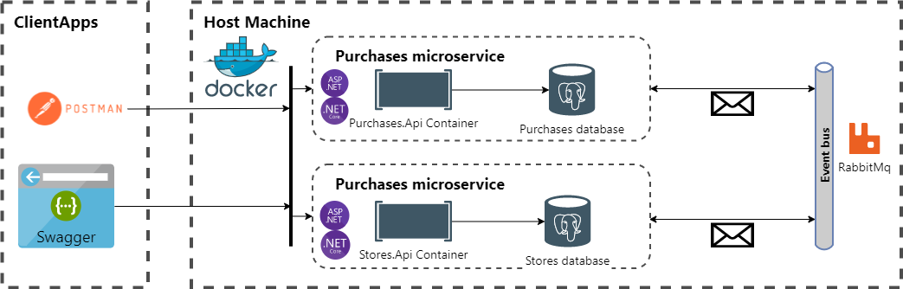

# Backend Web API for RTUITLab
An implementation of https://github.com/RTUITLab/Recruit/blob/master/requirements/back/README.md

| Status | Master | Develop |
| ------ | ---- | ---- |
|  Build and  test  | [](https://github.com/Inozpavel/RTUITLabBackend/actions/workflows/dotnet.yml)| [](https://github.com/Inozpavel/RTUITLabBackend/actions/workflows/dotnet.yml) |

## Prerequisites for launching

[Docker Desktop](https://www.docker.com/products/docker-desktop)

## Run system locally using Docker images

To run project open console in folder with [docker-compose.yml](docker-compose.yml?raw=true) file and run this commands

1. Pull services images from Docker Hub

```cmd
docker-compose pull
```

2. Run services

```cmd
docker-compose up -d
```

After starting API will be available on [localhost:8000](http://localhost:8000)
and [localhost:8001](http://localhost:8001)

## Project Information

#### Architecture

### Project technologies stack

Main framework
- [ASP.Net Core](https://dotnet.microsoft.com/apps/aspnet)

ORM
- [Entity Framework Core for PostgreSQL](https://github.com/npgsql/efcore.pg)

Database
- [PostgreSQL](https://www.postgresql.org/)

Message broker
- [RabbitMQ (MassTransit)](https://masstransit-project.com/usage/transports/rabbitmq.html)

Documentation
- [Swagger](https://github.com/domaindrivendev/Swashbuckle.AspNetCore)

Testing

- [xUnit](https://github.com/xunit/xunit)
- [Moq](https://github.com/moq/moq4)
- [AutoFixture](https://github.com/AutoFixture/AutoFixture)

Packages

- [AutoMapper](https://github.com/AutoMapper/AutoMapper)
- JWT Bearer for authentication
## Информация по сдаче итогового проекта
### 1. Информация про проект, UserStory, Макет
  * Дата сдачи: 4 марта 2021г
  * Баллы: 2 балла

### 2. Работа над проектом. Оформление ReadMe
  * Дата сдачи: 1 апреля 2021г
  * Баллы: 2 балла

### 3. Docker
  * Дата сдачи: 22 апреля 2021г
  * Баллы: 2 балла
